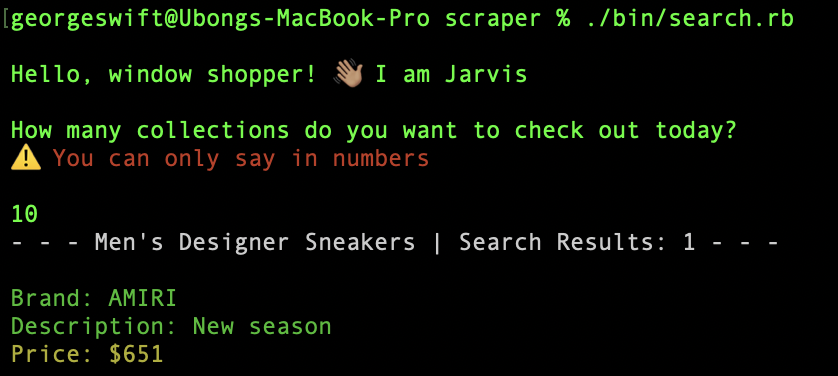
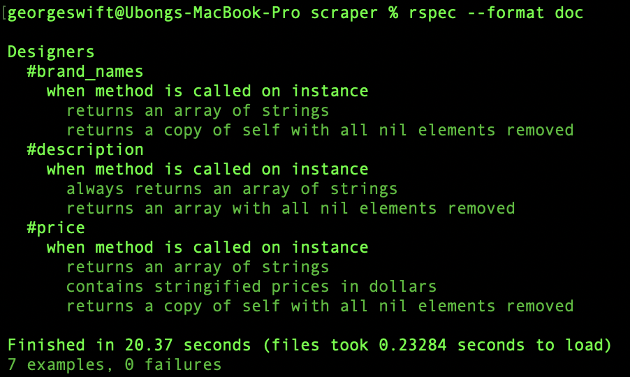

# Ruby Capstone Project: Build a Scraper

> The scraper is developed in Ruby and uses the Nokogiri gem to collect men's designer sneakers, details, and/or season information, and prices from my favorite online retail platform - [Farfetch](https://www.farfetch.com/ng/shopping/men/trainers-2/items.aspx)

## Built With

- Ruby

## Getting Started 

- Open your terminal - Windows: `Win + R`, then type `cmd` | Mac: `Command + space`, then type `Terminal`
- Navigate to a directory of your choosing using the `cd` command
- Run this command in your OS terminal: `git clone https://github.com/george-swift/scraper.git` to get a copy of the project.
- Navigate to the project's directory using the `cd` command.
- Execute `./bin/search.rb` or `cd bin` from the project's root folder and `ruby search.rb`

### Prerequisites

* Internet connection
* Ruby installed in your OS
* The Nokogiri ruby gem installed in your OS. To install, simply type `gem install nokogiri` in the terminal or `bundle install` from the project directory.

## Testing
- Open the terminal on the project root folder
- Execute `rspec --format doc` to run all the test cases  OR
- Run `bundle install` to install the required gems
- Execute `bundle exec rspec` to run all the test cases

👤 **Author**

- GitHub: [@george-swift](https://github.com/george-swift)
- Twitter: [@\_\_pragmaticdev](https://twitter.com/__pragmaticdev)

## 🤝 Contributing

Contributions, issues, and feature requests are welcome!

## Show your support

Kindly give a ⭐️ if you like this project!

## Acknowledgments

Hat tip to the following:
  - Farfetch for catalog of products
  - Nokogiri documentation for guidelines on installation
  - `Rubygems.org` documentation for guidelines on gems installation
  - Medium for additional think pieces

## 📝 License

This project is [MIT](https://www.mit.edu/~amini/LICENSE.md) licensed.